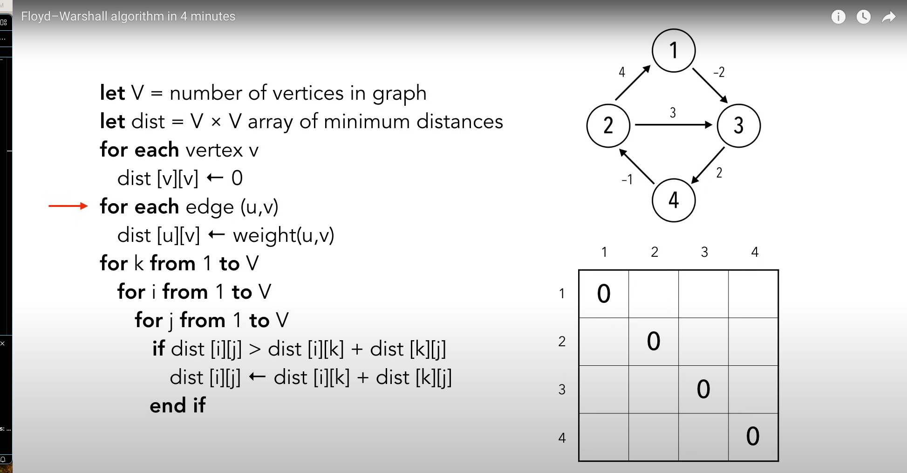
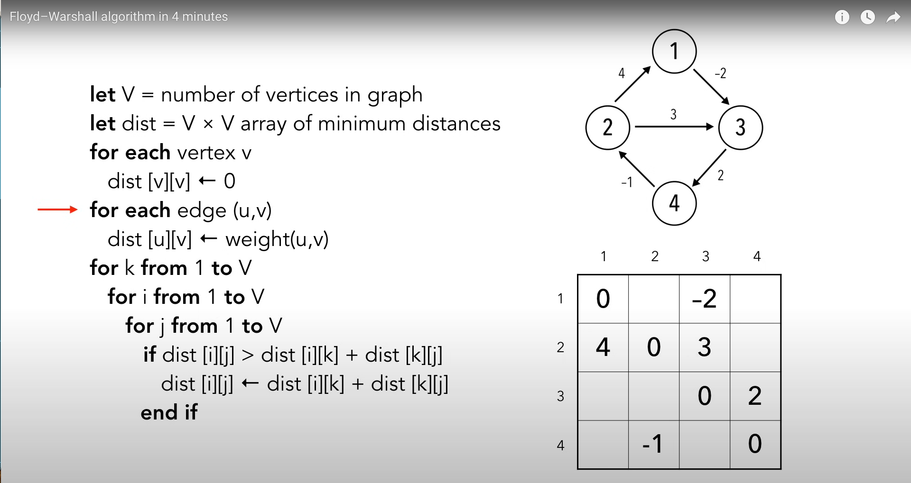
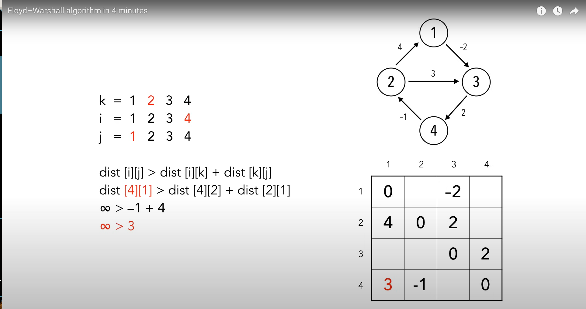
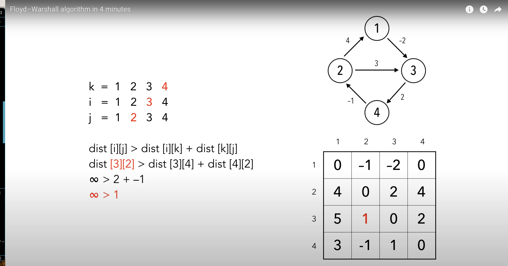

# Floyd–Warshall Algorithm

This algorithm finds shortest paths in a directed weighted graph with positive and negative edge weights.

## Comparison to Common Graph Algorithms


## Sudo Code:
```
Let V = # of vertices in the graph
Let dist = V x V matrix of minimum distances
for each vertex v:
    dist[v][v] <- 0
for each edge (u,v):
    dist[u][v] <- weight(u,v)
for k from 1 to V
    for i from 1 to V
        for j from 1 to V
            if dist[i][j] > dist[i][k] + dist[k][j]:
                dist[i][j] <- dist[i][k] + dist[k][j]
```

1. In the first `for` loop we set the distance from each loop to itself as zero.


2. In the second for loop we set the distance of each entry to the weight.


3. The inner loops and comparisons. Here we loop through and compare inner paths to see what values we can get.


4. Once we are done iterating we will have something like this.


The result is the shortest path between all nodes in the graph.

## Complexity
This algorithm has a time complexity of `O(V^3)` where `V` is the number of vertices because we have the inner triple `for` loop.

This algorithm also has a space complexity of O(V^2) since we have to create a matrix for the distances. This is a V x V matrix.

## Examples
* [From LeetCode WC 381: #3015 Count Number of Houses](https://leetcode.com/problems/count-the-number-of-houses-at-a-certain-distance-i/description/)

## Notes:
It should be rare to have someone ask you to code this by hand given the complexity of it.

## References
- [Wikipedia](https://en.wikipedia.org/wiki/Floyd–Warshall_algorithm)
- [Youtube in 4 Minutes](https://www.youtube.com/watch?v=4OQeCuLYj-4)