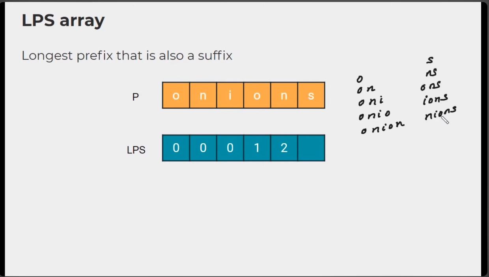
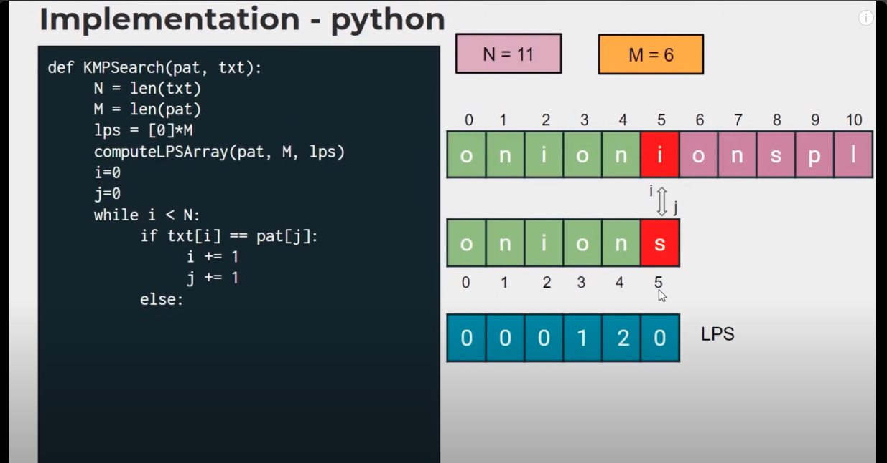

# KMP (Knuth–Morris–Pratt algorithm)

This is a string-searching algorithm. It searches for a word `W` in a text string `S`.

## History

The algorithm was conceived by James H. Morris and independently discovered by Donald Knuth "a few weeks later" from automata theory. Morris and Vaughan Pratt published a technical report in 1970. The three also published the algorithm jointly in 1977. Independently, in 1969, Matiyasevich discovered a similar algorithm, coded by a two-dimensional Turing machine, while studying a string-pattern-matching recognition problem over a binary alphabet. This was the first linear-time algorithm for string matching.

## Brute Force

We can increment until we find the first letter in the search word in the text string. Once we have we increment both until there is a mismatch then we go back to the start of the search string and increment one more.

This results in `O([n - m + 1] * m)` ~ `O(nm)` when `n >>> m` and `n` is the length of the text and `m` is the length of the search string.

## Sudo Code

Has a time complexity of O(n) and a space complexity of O(m)

```
algorithm kmp_search:
    input:
        an array of characters, S (the text to be searched)
        an array of characters, W (the word sought)
    output:
        an array of integers, P (positions in S at which W is found)
        an integer, nP (number of positions)

    define variables:
        an integer, j ← 0 (the position of the current character in S)
        an integer, k ← 0 (the position of the current character in W)
        an array of integers, T (the table, computed elsewhere)

    let nP ← 0

    while j < length(S) do
        if W[k] = S[j] then
            let j ← j + 1
            let k ← k + 1
            if k = length(W) then
                (occurrence found, if only first occurrence is needed, m ← j - k  may be returned here)
                let P[nP] ← j - k, nP ← nP + 1
                let k ← T[k] (T[length(W)] can't be -1)
        else
            let k ← T[k]
            if k < 0 then
                let j ← j + 1
                let k ← k + 1
```

## Explanantion

The problem with the brute force approach is that we are restartig the search over and over again when we have already looked at these characters before. 

We should use this knowledge when we restart to make our lives easier. We can generally skip all of the letters that we have looked at before assuming we do not have any overlapping letters.

To fix the case where we need to loop back some because there was a common prefix and suffix we can use a special array to help with this.


We use a special array called an LPS (Longest Prefix Suffix) to help with this calculation as show above and below.



Once we have the LPS we can use the values to determine how far back we need to loop to. In the example below we will look at index 4 after missing at 5. Given the value is 2 we will need to loop back to the 2 index in the search word.



After we loop back we will be at.


We also need to be able to implement the LPS array. This algorithm is similar to the search algorithm itself. We loop through and loop for similar patterns and then asign values that match.


As we see above we will assign the second o and number of 1 to match the position and length of the first one. The we ill increment and assign the next n a value of 2 as below.


Here are the two algorithms side-by-side.


## Examples:
- [LeetCode: 3006. Find Beautiful Indices in the Given Array I (med)](https://leetcode.com/problems/find-beautiful-indices-in-the-given-array-i/description/)
- [LeetCode: 3008. Find Beautiful Indices in the Given Array II (hard)](https://leetcode.com/problems/find-beautiful-indices-in-the-given-array-ii/description/)

## References
- [Wikipedia](https://en.wikipedia.org/wiki/Knuth–Morris–Pratt_algorithm)
- [YouTube Visualization](https://www.youtube.com/watch?v=pu2aO_3R118)
- [YouTube Explanation](https://www.youtube.com/watch?v=4jY57Ehc14Y)