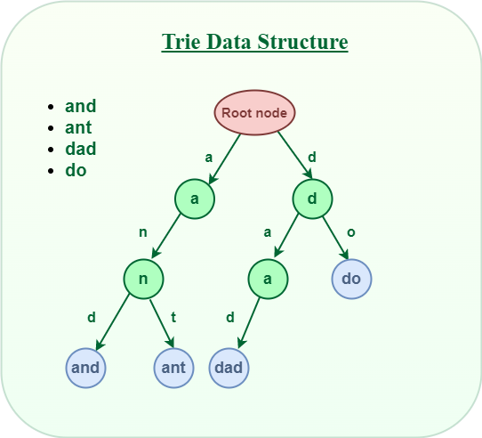
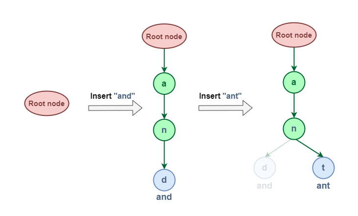

# Trie

A trie (derived from retrieval) is a mult-node tree datastructure. It can be used to effieciently match patterns for strings.

`The trie shows words like allot, alone, ant, and, are, bat, bad.`

All strings with a common prefix should come from the same node. Commonly used in speall checking programs.

## Structure



Every node consists of multiple branches. This is tracked by an array of letters and a boolean to mark if this is a potentially terminating word.

```Java
class TrieNode 
{
    TrieNode[] children = new TrieNode[ALPHABET_SIZE];
    // isEndOfWord is true if the node 
    // represents end of a word 
    boolean isEndOfWord;
}
```

## Insert Operation

Here is an example of adding `ant` to a trie with `and` in it. We would looke through the tree and string. Once we get to the `n` we will create a new node for `t` similar to `d` and add it as a child of `n` with terminating marked as true.



## Advantages of tries

1. In tries the keys are searched using common prefixes. Hence it is faster. The lookup of keys depends upon the height in case of binary search tree. 

2. Tries take less space when they contain a large number of short strings. As nodes are shared between the keys.

3. Tries help with longest prefix matching, when we want to find the key.

## Applications of tries

1. Tries has an ability to insert, delete or search for the entries. Hence they are used in building dictionaries such as entries for telephone numbers, English words.

2. Tries are also used in spell-checking softwares.

## Search Operation in Trie:

Searching for a key is similar to the insert operation. However, It only compares the characters and moves down. The search can terminate due to the end of a string or lack of key in the trie. 

* In the former case, if the isEndofWord field of the last node is true, then the key exists in the trie. 
* In the second case, the search terminates without examining all the characters of the key, since the key is not present in the trie.

## Implementation

```
// Java implementation of search and insert operations
// on Trie
public class Trie {
	
	// Alphabet size (# of symbols)
	static final int ALPHABET_SIZE = 26;
	
	// trie node
	static class TrieNode
	{
		TrieNode[] children = new TrieNode[ALPHABET_SIZE];
	
		// isEndOfWord is true if the node represents
		// end of a word
		boolean isEndOfWord;
		
		TrieNode(){
			isEndOfWord = false;
			for (int i = 0; i < ALPHABET_SIZE; i++)
				children[i] = null;
		}
	};
	
	static TrieNode root; 
	
	// If not present, inserts key into trie
	// If the key is prefix of trie node, 
	// just marks leaf node
	static void insert(String key)
	{
		int level;
		int length = key.length();
		int index;
	
		TrieNode pCrawl = root;
	
		for (level = 0; level < length; level++)
		{
			index = key.charAt(level) - 'a';
			if (pCrawl.children[index] == null)
				pCrawl.children[index] = new TrieNode();
	
			pCrawl = pCrawl.children[index];
		}
	
		// mark last node as leaf
		pCrawl.isEndOfWord = true;
	}
	
	// Returns true if key presents in trie, else false
	static boolean search(String key)
	{
		int level;
		int length = key.length();
		int index;
		TrieNode pCrawl = root;
	
		for (level = 0; level < length; level++)
		{
			index = key.charAt(level) - 'a';
	
			if (pCrawl.children[index] == null)
				return false;
	
			pCrawl = pCrawl.children[index];
		}
	
		return (pCrawl.isEndOfWord);
	}
	
	// Driver
	public static void main(String args[])
	{
		// Input keys (use only 'a' through 'z' and lower case)
		String keys[] = {"the", "a", "there", "answer", "any",
						"by", "bye", "their"};
	
		String output[] = {"Not present in trie", "Present in trie"};
	
	
		root = new TrieNode();
	
		// Construct trie
		int i;
		for (i = 0; i < keys.length ; i++)
			insert(keys[i]);
	
		// Search for different keys
		if(search("the") == true)
			System.out.println("the --- " + output[1]);
		else System.out.println("the --- " + output[0]);
		
		if(search("these") == true)
			System.out.println("these --- " + output[1]);
		else System.out.println("these --- " + output[0]);
		
		if(search("their") == true)
			System.out.println("their --- " + output[1]);
		else System.out.println("their --- " + output[0]);
		
		if(search("thaw") == true)
			System.out.println("thaw --- " + output[1]);
		else System.out.println("thaw --- " + output[0]);
		
	}
}
// This code is contributed by Sumit Ghosh

```

## Examples
- [LeetCode: 2935. Maximum Strong Pair XOR II (hard)](https://leetcode.com/problems/maximum-strong-pair-xor-ii/description/)
- [Leetcode: 3093. Longest Common Suffix Queries (hard)](https://leetcode.com/problems/longest-common-suffix-queries/description/)

## References
- [Geeks4Geeks](https://www.geeksforgeeks.org/trie-insert-and-search/)