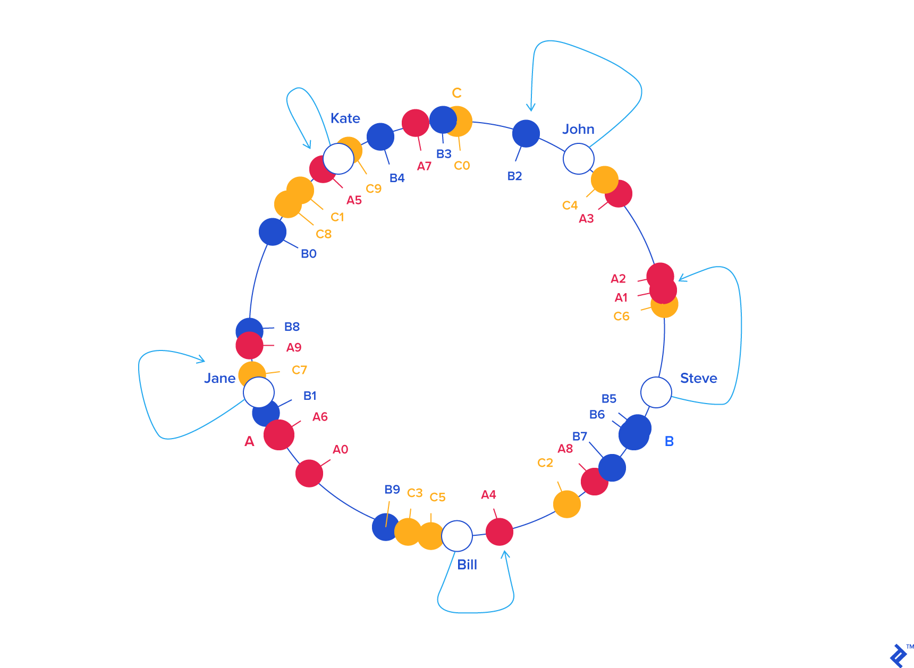
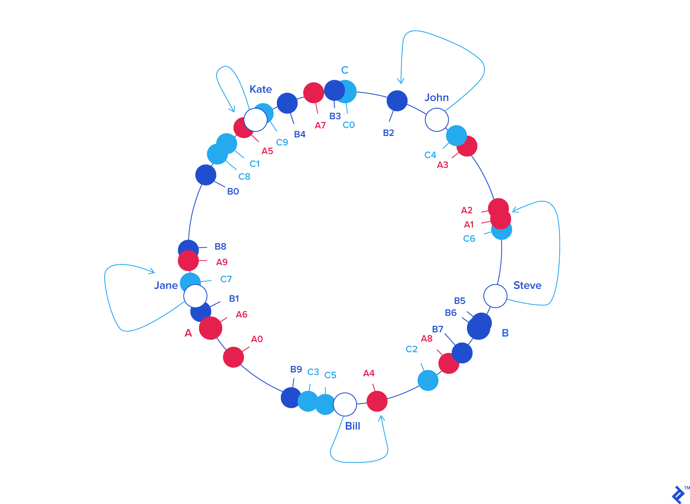
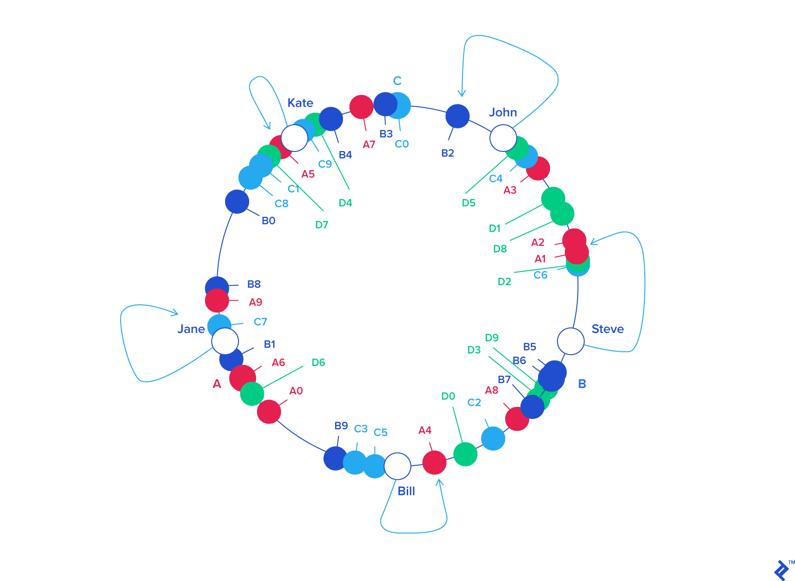

# Load Balancing

In this section we are going to learn about load balancing.

## Scaling Out: Distributed Hashing

Hashing is the act of breaking something down into smaller pieces. 
The goal for hashing with moth things in technology is to break them down into more manageable bites. Such as calls to application nodes or databases.

There are a whole bunch of ways to hash something we can send strings (name or login id) or requests ids to certain numbers. We can use locations.

Different hash functions are used at different times essentially. 

The usual implementation would be convert a word to a number and then mod it over the number of servers to map it somewhere.

### Rehashing Problem

The main issue is when we add a new node or subtract them. This causes a rehashing problem because old data will now need to be remapped to new nodes.

We will have a lot of misses for previous data because it is now in a new server location. 

### Solution: Consistent Hashing

Karger et al. at MIT in an academic paper from 1997 (according to Wikipedia) wrote an algorithm to solve this.

For this type of hashing we pretend that all of the servers are located on a ring essentially. The biggest integer would now essentially be 2pi.

We now figure out what the angle for a piece of data is by using a similar hashing method as above. We then look on the ring and see what the closer server before this number was and we use that for the data.

We will not assign one but many labels to the same servers such as `A0...A9` to server `A` and `C0..C9` for server `C`. Such as the example below.

The good thing about this is that we do not need to recalculate the hash for each item if we add or delete a node. If we delete `C` for example we only need to recalculate the values that were in `C` the nodes for `A` and `B` are still good.

Somthing similar happens when we add a new server. We will now need to reassign about a 1/3 of the data to the new server.

In general we need to reassign `k/n` keys where `k` is the number of keys and `n` is the number of servers.

## References 

- [Toptal](https://www.toptal.com/big-data/consistent-hashing)
- [Gaurav Sen: YouTube: Load Balancing](https://www.youtube.com/watch?v=K0Ta65OqQkY&list=PLMCXHnjXnTnvo6alSjVkgxV-VH6EPyvoX&index=3)
- [Gaurav Sem: YouTube: Consistent Hashing](https://www.youtube.com/watch?v=zaRkONvyGr8&list=PLMCXHnjXnTnvo6alSjVkgxV-VH6EPyvoX&index=4)