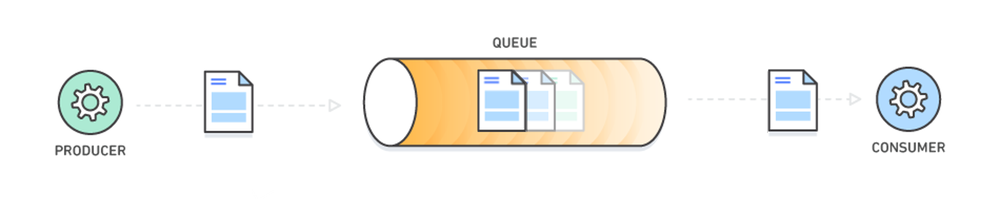

# Message Queue

A message queue is essentially a list that allows distributed systems to communicate with each other asynchronosouly.

Each message is stored until it is ready to be processed and is then deleted. 

In our pizza shop example we would no longer wait for the services to start making the pizza before responding. We would store this in the queue and give the customer a more generic response. Then once the queue has processed this request it could send the customer an email saying that their pizza is in the oven. etc.

## Examples 

- Amaazon Simple Queue Service (AWS SQS).
- Note this is usually done as a 1-to-1 communication and for something like 1-to-many we would use `AWS Simple Notification Service` instead.

## References
- [Gaurav Sen YouTube](https://www.youtube.com/watch?v=oUJbuFMyBDk&list=PLMCXHnjXnTnvo6alSjVkgxV-VH6EPyvoX&index=5)
- [AWS](https://aws.amazon.com/message-queue/)