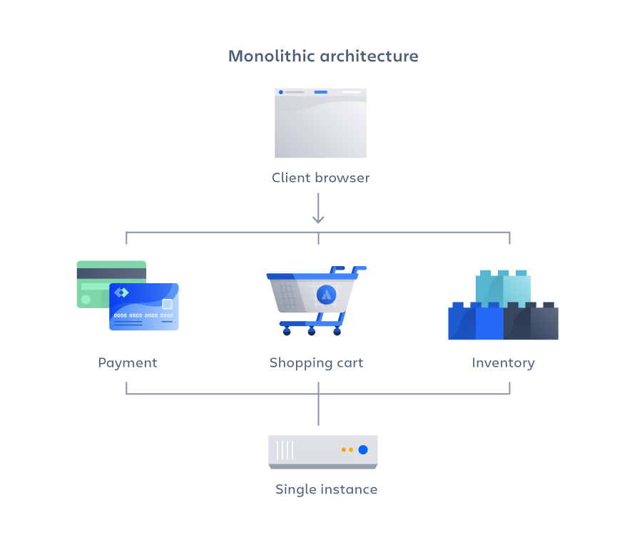
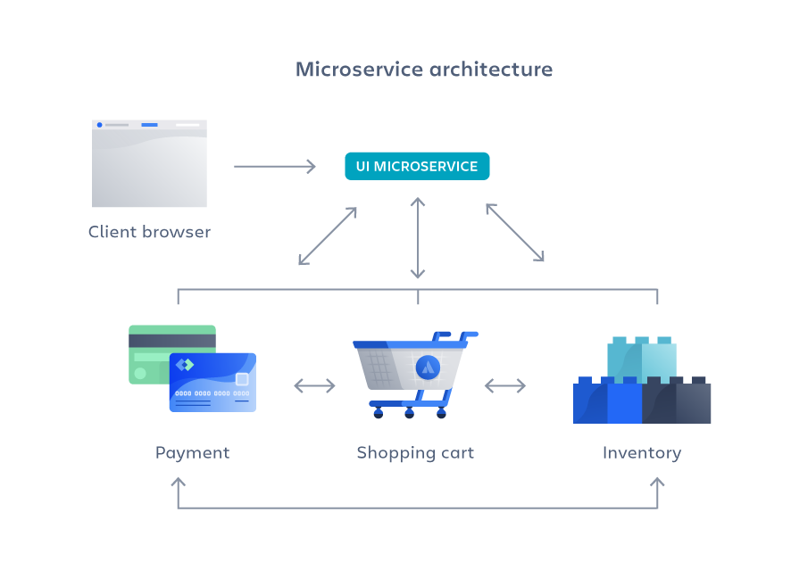

# MicroService vs Monolith Architecture

In this article we settle the age old debate of using a microservice before a monolith.

Netflix was one of the first companies to go from being an on-premise monolithlic service to a distributed cloud based system (2009 - 2015).
Amazon was another pioneer of this which is why AWS is so comprehensive.

## Monolith

A monolith is usually a large code base that runs on one or few machines. This is usually how an application begins.

For a code change to be made, we work in one code base, then that one code base gets deployed to one or several computers.

Monoliths are very convienet for starting a project.

In the example below we have the payments, shopping cart, and inventory all handled by the same single instance computer.

### Advantages
- Easy deployments: one code base to deploy and done.
- Development: only need to read through one set of code instead of thousands of packages.
- Performace: we don't need to make calls across a network only to other pieces of code inside the same code base.
- Simplified testing: Since everything is in one place we only need to end-2-end test one service instead of making sure one service doesn't break another.
- Easy Debugging: it is generally easier to look through the code and track down bugs instead of needing a bunch of different packages.

### Disadvantages
- Slower development speed: it takes time to understand all the code and usually we need to wait to do deployments at a key time.
- Scalability: we have to scale the whole system instead of individual pieces.
- Reliability: one error in one module could break the whole system.
- Barriers to technology adoption: a change in language or framework requires the entire code base to change.
- Lack of flexibility: the monolith is constrained by what it already uses.
- Deployment: small changes require redeployment of the entire system.

## Microservices

Microservices generally break down monoliths into smaller business units that allow them to be worked on and scaled independently.

They don't really reduce the complexity but make it more visible.

### Advantages

- Agility: promote smaller teams and agile delivery patterns. 
- Flexible scaling: each microservice can scale independtly at different times without affecting other services.
- Continuous deployment: they allow for faster and more often deployments without fear of breaking the whole system.
- Highly maintainable and testable: Teams can experiment and try new features easier. They also know their code base better and each microservice is usally tested individually and as part of the system as a whole.
- Independently deployable: Each service can be deployed independently.
- Technology flexibility: each team can select what tools they want to use for their individual service.
- High reliability: if a service breaks we can just revert that one piece and instead of needing to revert the whole Monolith.
- Happier Teams: atlassian found their teams to be happier when working on microservices because they didn't need to wait weeks for pull requests and didn't feel as overwhelmed by the system code.

### Disadvantages

- Development Sprawl: Microservices add more complexity compared to a monolith arch. As there are more teams and more service in more places. It increases communication needs.
- Exponential Infrastructure Costs: Each new service costs more money. They also need their own playbooks, infrastructure, monitoring tools, and more.
- Organization Overhead: teams need to communicate and collaborate more as stated above.
- Debugging Challenges: each service has it owns sets of logs and debugging needs. Also one service could be breaking another service now.
- Lack of standardizations: since each team controls its code base there might not be real standards across teams now.
- Lack of clear ownership: it can be confusing as to what team owns what service. Especially as they become stale and team structures change.

# References
- [Gaurav Sen YouTube](https://www.youtube.com/watch?v=qYhRvH9tJKw&list=PLMCXHnjXnTnvo6alSjVkgxV-VH6EPyvoX&index=6)
- [Atlassian](https://www.atlassian.com/microservices/microservices-architecture/microservices-vs-monolith)

